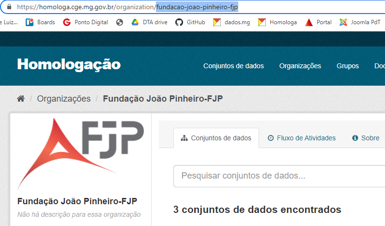

# ERROS COMUNS NA PUBLICAÇÃO E ATUALIZAÇÃO DO CONJUNTO DE DADOS

## Nome `name` do conjunto no arquivo de metadados

Observar se o mesmo nome inserido na propriedade `name` do conjunto de dados já foi utilizado em outro conjunto publicado no Portal, **inclusive em outras Organizações**.

- A mensagem de erro que o pacote `dpckan` retorna na CLI (linha de comando/BASH cell): 

````
$ dpckan --ckan-host $HOMOLOGA_HOST --ckan-key $HOMOLOGA_KEY dataset create
Dataset pib-teste j▒ publicado acesse https://homologa.cge.mg.gov.br/dataset/pib-teste
````

- Como estava grafado no `datapackage.json`:

````  
],
  "keywords": [
    "pib",
    "economia"
  ],
  "name": "pib-teste",
  "title": "PIB testes",
  "description": "Informações sobre o PIB",
  ````

Uma solução simples é inserir a sigla da organização e/ou da área ma propriedade `name`:

  ````
  ],
  "keywords": [
    "pib",
    "economia"
  ],
  "name": "pib-teste-fjp",
  "title": "PIB testes",
  "description": "Informações sobre o PIB",
  ````


## Propriedade `owner_org` ausente no arquivo de metadados

Datapackage sem a propriedade `owner_org` obrigatória, que indica a organização à qual pertence o conjunto (ou grafada incorretamente, com hífenem vez de underline).

- A mensagem de erro que o pacote `dpckan` retorna na CLI (linha de comando/BASH cell):

````
$ dpckan --ckan-host $HOMOLOGA_HOST --ckan-key $HOMOLOGA_KEY dataset create
Arquivo datapackage.json sem a propriedade `owner_org` obrigat▒ria
````

A solução é inserir o nome da Organização como valor da propriedade `owner_org`:

````
  ],
  "keywords": [
    "pib",
    "economia"
  ],
  "name": "pib-teste-fjp",
  "title": "PIB testes",
  "description": "Informações sobre o PIB",
  "owner_org": "fundacao-joao-pinheiro-fjp",
  ````

Tal qual aparece na URL da página da própria organização que está criada no Portal:

 


## Modificações não salvas para atualização

O `dpckan` retorna a seguinte mensagem se não houver mudanças nos arquivos de dados ou metadados:

````
$ dpckan --ckan-host $HOMOLOGA_HOST --ckan-key $HOMOLOGA_KEY dataset update
Nothing to be updated in dataset https://homologa.cge.mg.gov.br/dataset/pib-teste-fjp.
````

Verificar as mudanças desejadas para serem atualizadas no Portal foram salvas nos arquivos corretos. Na CLI, o comando do git que informa se houve mudanças no repositório que hospeda o dataset é : `git status`. Exemplo de resposta a esse comando, que informa modificações feitas no `datapackage.json`:

````
$ git status
On branch main
Your branch is up to date with 'origin/main'.

Changes not staged for commit:
  (use "git add <file>..." to update what will be committed)
  (use "git restore <file>..." to discard changes in working directory)
        modified:   datapackage.json

```` 

Um detalhamento possível para saber o que foi modificado no `datapackage.json`, a partir do comando `git diff`:

````
$ git diff datapackage.json
diff --git a/datapackage.json b/datapackage.json
index 0cf8b27..c37e27d 100644
--- a/datapackage.json
+++ b/datapackage.json
@@ -30,12 +30,12 @@
     "pib",
     "economia"
   ],
-  "name": "pib-teste",
+  "name": "pib-teste-fjp",
   "title": "PIB testes",
-  "description": "Este conjunto é capaz de informar se determinada letra é uma vogal ou não",
+  "description": "Informações sobre o PIB",
+  "owner_org": "fundacao-joao-pinheiro-fjp",
   "homepage": "https://github.com/fjuniorr",
   "version": "0.0.1",
-  "owner_org": "fundacao-joao-pinheiro-fjp",
````

Verificar se essas modificações apontadas no `git diff` já não foram publicadas no Portal.


## Sintaxe do comando 

Pode faltar um argumento para a chamada da função, que tem a estrutura: 

[ dpckan ] + [ flag host ] + [ flag key ] + [ dataset ] + [ create/update ]. Por exemplo:

````
$ dpckan --ckan-host $HOMOLOGA_HOST --ckan-key $HOMOLOGA_KEY update
Usage: dpckan [OPTIONS] COMMAND [ARGS]...
Try 'dpckan -h' for help.

Error: No such command 'update'.

````
Faltou inserir o argumento `dataset`: `dpckan --ckan-host $HOMOLOGA_HOST --ckan-key $HOMOLOGA_KEY dataset update`