# Erros comuns de validação

## 1. Sobre os arquivos de metadados e seu conteúdo

#### 1.1. Sintaxe do `datapackage.json`:

**a. faltou abrir ou fechar algum campo com aspas, "", colchetes '[ ]' ou chaves '{ }'**

````$ frictionless validate datapackage.json
# -------
# invalid: datapackage.json
# -------
=============  ===================================================================================================================================
code           message                                                          
=============  ===================================================================================================================================
package-error  The data package has an error: cannot extract metadata "datapackage.json" because "Expecting value: line 101 column 28 (char 3812)"
=============  ===================================================================================================================================
````

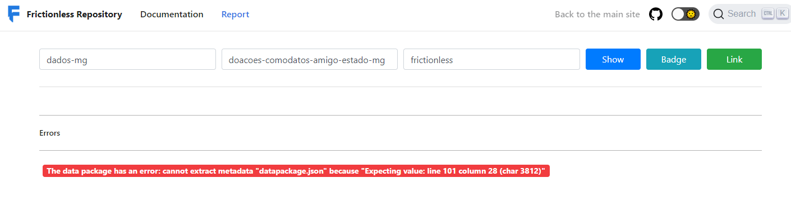


* Solução: corrigir a sintaxe do arquivo datapackage.json na linha indicada pela mensagem de erro, utilizando o editor de texto ou o editor de arquivos do github (que também podem fazer marcações visuais de erros de sintaxe)

**b. faltou/sobrou alguma vírgula**

````$ frictionless validate datapackage.json
# -------
# invalid: datapackage.json
# -------
=============  ==========================================================================================================================================
code           message                                                          
=============  ==========================================================================================================================================
package-error  The data package has an error: cannot extract metadata "datapackage.json" because "Expecting ',' delimiter: line 96 column 11 (char 3621)"
=============  ==========================================================================================================================================

````

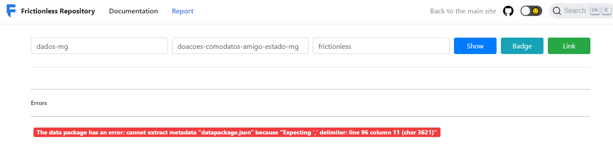


* **Solução**: corrigir a sintaxe do arquivo datapackage.json na linha indicada pela mensagem de erro, utilizando o editor de texto ou o editor de arquivos do github (que também podem fazer marcações visuais de erros de sintaxe)

#### 1.2. Nome `name` do recurso contém caracteres fora da faixa permitida

````$ frictionless validate datapackage.json
# -------
# invalid: datapackage.json
# -------
=============  ================================================================================================================================================================================================================
code           message                                                                                                                                          
=============  ================================================================================================================================================================================================================
package-error  The data package has an error: "'doa▒▒es-comodatos-amigo-estado-mg' does not match '^([-a-z0-9._/])+$'" at "resources/0/name" in metadata and at "properties/resources/items/properties/name/pattern" in profile
=============  ================================================================================================================================================================================================================
````


* **Solução**: corrigir a propriedade `name` contendo [especificações legíveis por máquina](https://specs.frictionlessdata.io/data-resource/#metadata-properties) (i.e. letras minúsculas, sem espaços, sem caracteres especiais)


#### 1.3. O caminho `path` incorreto

**a. onde se localizam os arquivos de dados:**

````$ frictionless validate datapackage.json
# -------
# invalid: doacoes-comodatos-amigo-estado-mg.csv
# -------

===  =====  ============  ==============================================================================================================================
row  field  code          message                                               
===  =====  ============  ==============================================================================================================================
            scheme-error  The data source could not be successfully loaded: [Errno 2] No such file or directory: 'doacoes-comodatos-amigo-estado-mg.csv'
===  =====  ============  ==============================================================================================================================
````

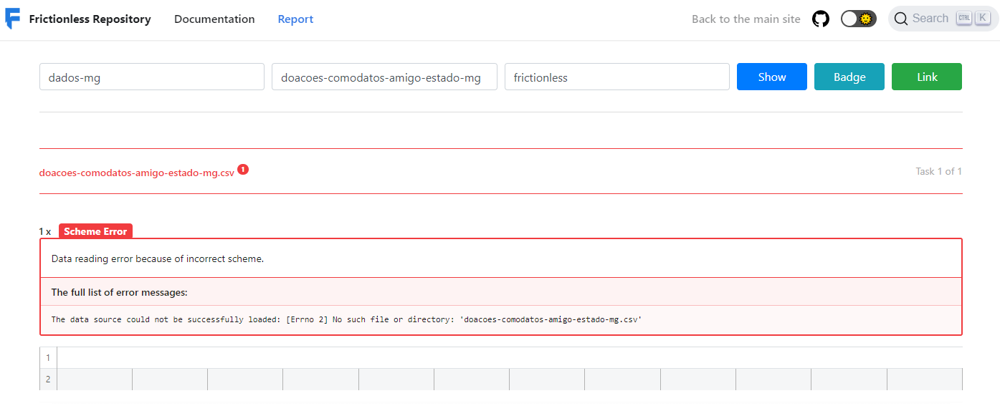


* **Solução**: corrigir o valor da propriedade `path` incorporando o nome da pasta ou URL onde se localiza o recurso, ou corrigindo o nome do recurso, se for o caso

**b. onde se localizam os arquivos de metadados `datapackage.json`, o `schema.json`, ou o `dialect.json`**

````$ frictionless validate datapackage.json
# -------
# invalid: datapackage.json
# -------
============  =======================================================================================================================
code          message                                                           
============  =======================================================================================================================
schema-error  Schema is not valid: cannot extract metadata "schema.json" because "[Errno 2] No such file or directory: 'schema.json'"
============  =======================================================================================================================
````

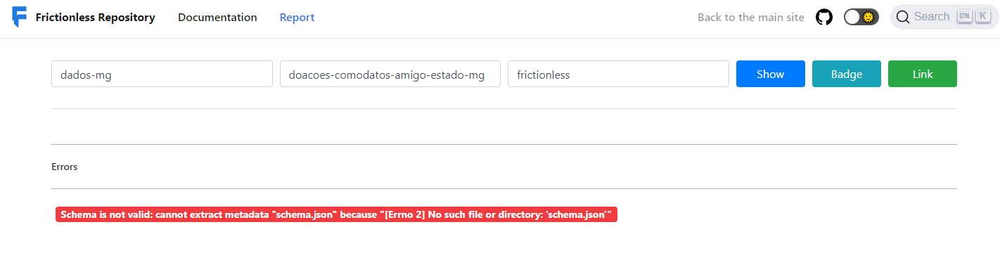


* **Solução**: corrigir o valor da propriedade `path` incorporando o nome da pasta ou URL onde se localiza o `schema` ou `dialect`, ou corrigindo seu nome, se for o caso


## 2. Sobre os arquivos de dados e seu conteúdo

#### 2.1. Divergências de características dos dados no `datapackage.json`

**a. formatos de data**


**b. dado obrigatório ausente**

````$ frictionless validate datapackage.json
# -------
# invalid: data/doacoes-comodatos-amigo-estado-mg.csv
# -------

===  =====  ==========  =================================================================================================
row  field  code        message                                                 
===  =====  ==========  =================================================================================================
 51      9  type-error  Type error in the cell "" in row "51" and field "VALOR" at position "9": type is "number/default"
===  =====  ==========  =================================================================================================
````

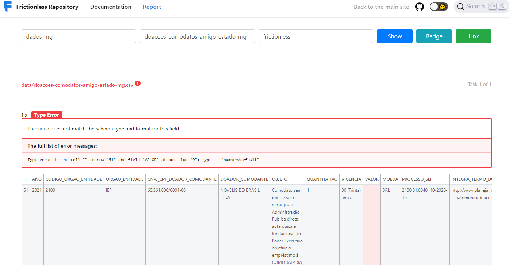


````          {
            "name": "VALOR",
            "type": "number",
            "format": "default",
            "title": "Valor",
            "description": "Valor estimado do bem ou serviço doado ou oferecido em comodato. Pode ser em moeda nacional ou estrangeira.",
            "groupChar": ".",
            "decimalChar": ","
          }
        ]
        "missingValues": [
          "NA"
        ]
````


* **Solução**: completar o valor ausente indicado no arquivo do recurso. Se ele não for obrigatório, aplicar 'NA' na célula indicada no arquivo do recurso


**c. valor numérico não inteiro**

- faltou informar os separadores de milhar (groupChar) e decimais (decimalChar):            

````$ frictionless validate datapackage.json
# -------
# invalid: data/doacoes-comodatos-amigo-estado-mg.csv
# -------

===  =====  ==========  =============================================================================================================
row  field  code        message
===  =====  ==========  =============================================================================================================
  2      9  type-error  Type error in the cell "300.000,00" in row "2" and field "VALOR" at position "9": type is "number/default"
  3      9  type-error  Type error in the cell "220.000,00" in row "3" and field "VALOR" at position "9": type is "number/default"
  4      9  type-error  Type error in the cell "347.000,00" in row "4" and field "VALOR" at position "9": type is "number/default"
````
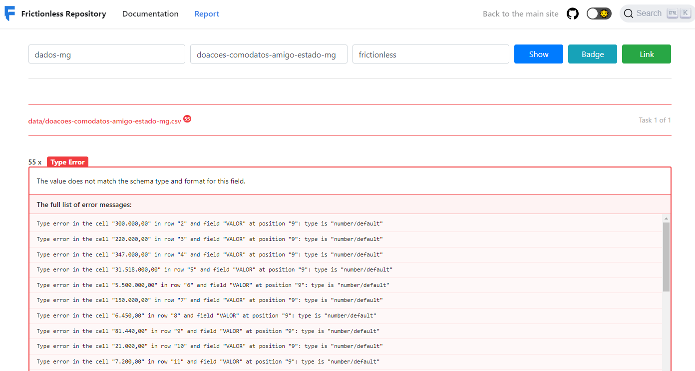


* **Solução**: aplicar as propriedades de separador de milhar `groupChar` e/ou separador de decimais `decimalChar`, sempre quando o valor numérico utilizar essa grafia. Alterar o valor da propriedade `type` de `integer` para `number`:

````
"type": "number",
"format": "default",
"title": "Valor",
"groupChar": ".",
"decimalChar": ","
````

**d. valor fora das características informadas**

  i. type-error

````$ frictionless validate datapackage.json
# -------
# invalid: data/doacoes-comodatos-amigo-estado-mg.csv
# -------

===  =====  ==========  =======================================================================================================
row  field  code        message                                                 
===  =====  ==========  =======================================================================================================
  2      9  type-error  Type error in the cell "300000%" in row "2" and field "VALOR" at position "9": type is "number/default"
===  =====  ==========  =======================================================================================================
````
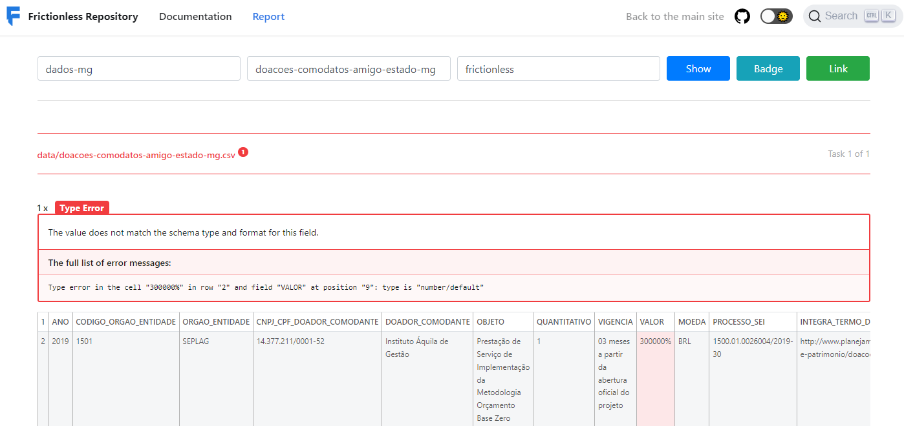


* **Solução**: alterar os valores no arquivo do recurso, observando as características das variáveis numéricas indicadas no `datapackage.json`. Caso o problema tenha sido na descrição do dado, alterar as propriedades necessárias no `datapackage.json`  
  
  ii. constraint-error - pattern

````
$ frictionless validate datapackage.json
# -------
# invalid: data/doacoes-comodatos-amigo-estado-mg.csv
# -------

===  =====  ================  ==============================================================================================================================================
row  field  code              message                                                                                                                           
===  =====  ================  ==============================================================================================================================================
  2     10  constraint-error  The cell "R$" in row at position "2" and field "MOEDA" at position "10" does not conform to a constraint: constraint "pattern" is "^[A-Z]{3}$"
===  =====  ================  ==============================================================================================================================================

````
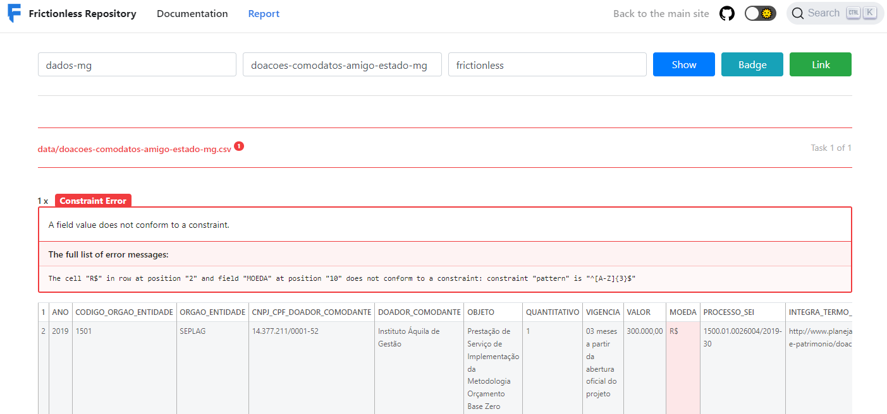


* **Solução**: alterar os valores no arquivo do recurso, observando as características das variáveis indicadas no `datapackage.json`. Caso o problema tenha sido na descrição do dado, alterar as propriedades necessárias no `datapackage.json`


#### 2.2. valores fora dos campos delimitadores (, ou ;):

````
$ frictionless validate datapackage.json
# -------
# invalid: datapackage.json
# -------
==========  ======================================
code        message
==========  ======================================
task-error  The task has an error: 'fieldPosition'
==========  ======================================
````

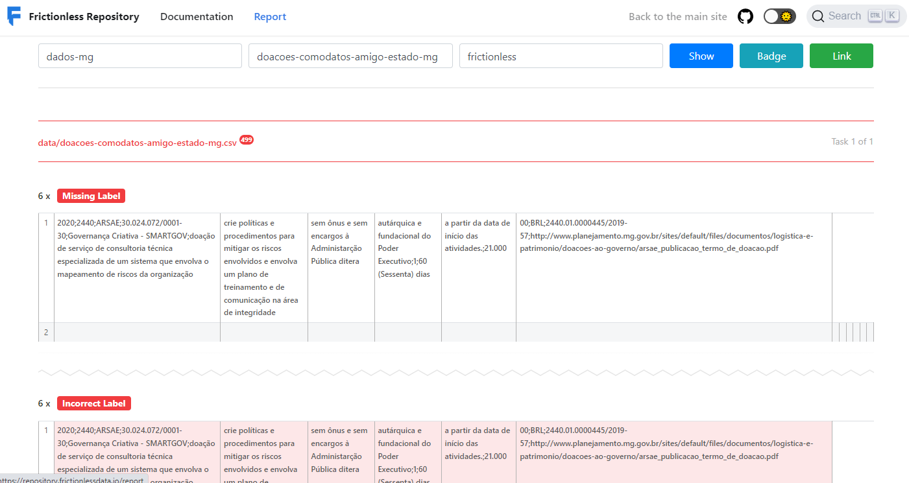

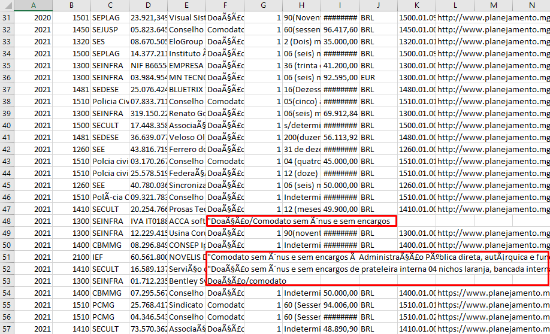

* Solução: verificar se colunas de texto contêm ',' e/ou ';' que possam estar sendo interpretados como delimitadores de coluna. Delimitar os valores das colunas de texto em suas respsectivas células, utilizando aspas no editor de `csv`)


#### 2.3. Arquivo de dados sem encoding `utf-8` 

a. encoding Western, Latin, Windows...


b. encoding UTF-8 sem Byte Order Mask (BOM)

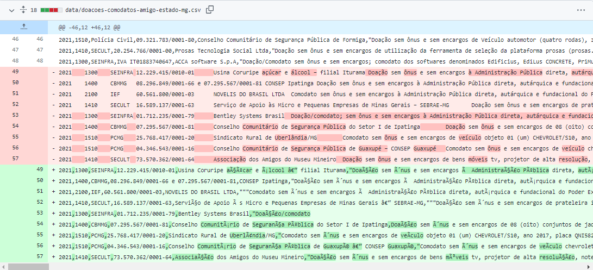

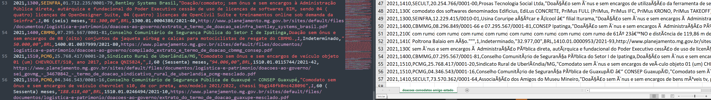

* **Solução**: gerar o arquivo `csv` com o BOM. No editor de texto Sublime, 'Save with Encoding --> UTF-8 with BOM'

- - - 

## Lista de verificação Frictionless - 'Validation Checks'

````
['hash-count-error',
 'byte-count-error',
 'field-count-error',
 'row-count-error',
 'blank-header',
 'extra-label',
 'missing-label',
 'blank-label',
 'duplicate-label',
 'incorrect-label',
 'blank-row',
 'primary-key-error',
 'foreign-key-error',
 'extra-cell',
 'missing-cell',
 'type-error',
 'constraint-error',
 'unique-error']
 ````